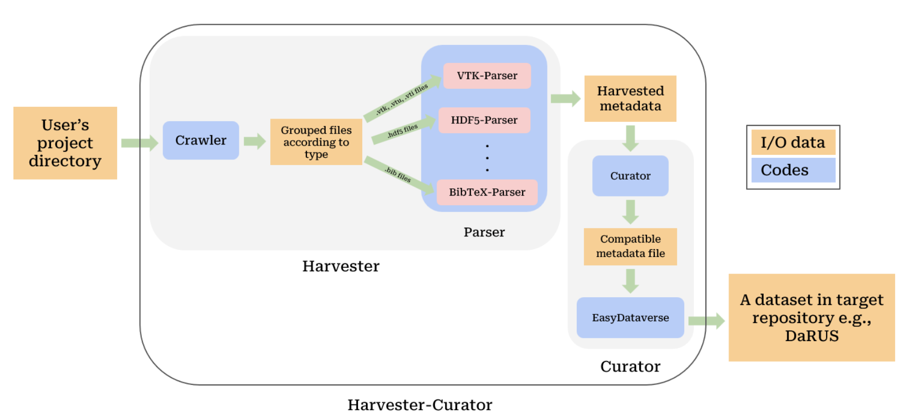

# Harvester-Curator

<!---->

`Harvester-Curator` is a Python-based automation tool designed to streamline the collection and provision of metadata in research data management. It automates the extraction of metadata from source repositories or directories, then seamlessly maps and integrates the collected metadata into designated research data repositories, with a particular emphasis on Dataverse installations.

## Tool Workflow

<!---->

`Harvester-Curator` optimizes metadata collection and integration in two main phases:

**Harvester Phase**: Automates the extraction of metadata from user-specified directories.
<!---->

**Curator Phase**: Seamlessly maps and integrates extracted metadata into the target repository.
<!---->

### Harvester Phase

During the initial `Harvester` phase, a crawler methodically scans files within the source directory and its subdirectories, sorting them by type and extension. This results in files being systematically grouped for further processing. Customized parsers are then utilized to extract metadata from these categorized groups, compiling the data into a well-organized JSON format.

<!---->

We currently support a variety of parsers, including VTK, HDF5, CFF, BibTeX, YAML and JSON: 

**VTK-parser**: Supports file types such as `vtk`, `vti`, `vtr`, `vtp`, `vts`, `vtu`, `pvti`, `pvtr`, `pvtp`, `pvts` and `pvtu`.

**HDF5-parser**: Handles formats including `hdf5`, `h5`, `he5`.

**JSON-parser**: Processes types `json` and `jsonld`.

## Curator Phase

In the subsequent `Curator` phase, `Harvester-Curator` aligns the harvested metadata with the metadata schemas of the target repository, such as DaRUS. It matches the harvested metadata attributes with those defined in the metadata schemas and integrates the values into the appropriate locations. Additionally, it supports direct upload of curated metadata to the destination repository. 

<!---->

The `Curator` algorithm employs mappings to reconcile discrepancies between the naming conventions of harvested metadata and the metadata schemas of the target repository. Given that harvested metadata typically features a flat structure -- where attributes, values, and paths are at the same level, unlike the hierarchical organization common in repository schemas—-the algorithm adapts harvested metadata to ensure compatibility:

1. **Mapping and Matching**: It begins by updating attribute values and paths of harvested metadata based on predefined mappings, taking into account the hierarchical structure of repository schemas.
2. **Attribute Matching**: The algorithm searches for matching attributes within the target repository's schema. If no direct match is found, it combines parent and attribute information in search of a suitable match. Attributes that remain unmatched are noted for subsequent matching attempts with an alternative schema. 
3. **Parent Matching**: Upon finding a match, the algorithm designates the corresponding parent from the schema as the "matching parent." If a direct parent match does not exist, or if multiple matches are found, it examines common elements between the schema and harvested metadata to determine the most appropriate matching parent.
4. **Dictionary Preparation**: Attributes that successfully match are compiled into a dictionary that includes the mapped attribute, value, parent, and schema name, ensuring the metadata is compatible with the target repository.
5. **Similarity Matching**: When exact matches are not found across all schemas, the algorithm employs similarity matching with an 85% threshold to accommodate differences in metadata schema integration.

This systematic approach ensures compatibility with the requirements of the target repository and enhances the precision of metadata integration by utilizing direct mapping, exact matching and similarity matching to overcome schema alignment challenges.

In essence, `Harvester-Curator` synergizes file crawling and crosswalking capabilities to automate the complex and labor-intensive processes of metadata collection and repository population. Tailored for efficiency and accuracy in Dataverse environments, it equips researchers with a streamlined method to accelerate data management workflows, ensuring that their research data aligns with the FAIR principles of Findability, Accessibility, Interoperability, and Reusability.

